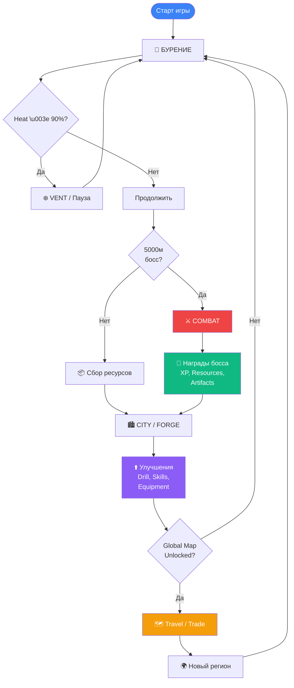
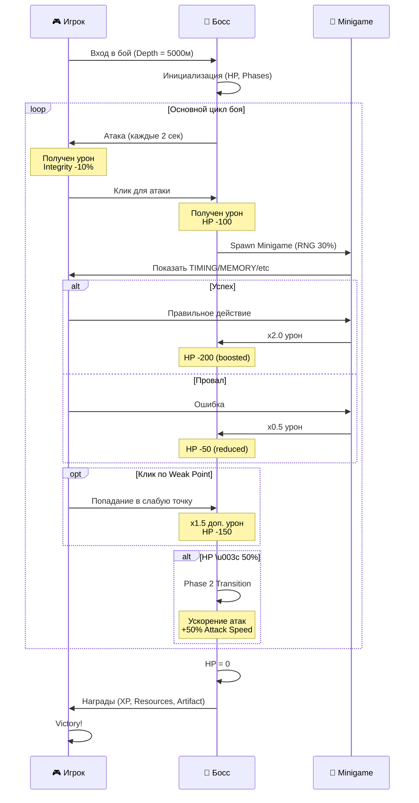

# 🚀 COSMIC EXCAVATOR: VOID-PIERCER
## Полный дизайн-документ игры (Game Design Document)

---

<div align="center">

**Версия:** 0.3.1  
**Жанр:** Sci-Fi Idle Clicker / Incremental  
**Платформа:** Web (Desktop + Mobile)  
**Язык:** Русский / English  
**Дата обновления:** 2026-01-20

*Хардкорный космический кликер о раскопках в бездне планеты Aegis-7*

</div>

---

## 📋 СОДЕРЖАНИЕ

1. [КОНЦЕПЦИЯ ИГРЫ](#-концепция-игры)
2. [CORE LOOP](#-core-loop-игровая-петля)
3. [ОСНОВНЫЕ СИСТЕМЫ](#-основные-системы)
4. [ПРОГРЕССИЯ И КОНТЕНТ](#-прогрессия-и-контент)
5. [ГЛОБАЛЬНАЯ КАРТА](#-глобальная-карта-global-map)
6. [БОЕВАЯ СИСТЕМА](#-боевая-система)
7. [СИСТЕМЫ УЛУЧШЕНИЙ](#-системы-улучшений)
8. [ЭКОНОМИКА И БАЛАНС](#-экономика-и-баланс)
9. [НАРРАТИВ И ЛОРЕ](#-нарратив-и-лоре)
10. [ДИЗАЙН ИНТЕРФЕЙСА](#-дизайн-интерфейса)
11. [ТЕХНИЧЕСКИЙ СТЕК](#-технический-стек)
12. [ФИЛОСОФИЯ ДИЗАЙНА](#-философия-дизайна)

---

## 🌌 КОНЦЕПЦИЯ ИГРЫ

### Что это за игра?

**Cosmic Excavator: Void-Piercer** — это **хардкорный sci-fi кликер** о глубинных раскопках на мёртвой планете **Aegis-7**. Игрок управляет **буровой установкой** и погружается всё глубже в недра планеты, добывая ресурсы, сражаясь с боссами и раскрывая тайны древней цивилизации.

### Ключевые особенности:

✅ **Хардкорность**: Никаких лёгких побед. Игрок должен «потеть», чтобы получить прогресс  
✅ **Бесконечная прогрессия**: Нет престижа или сброса — только линейный рост вглубь  
✅ **Система измерений**: Портал в новое измерение = hard reset с новым тиром снаряжения  
✅ **Глубокая кастомизация**: 10 слотов оборудования, артефакты, навыки, дроны  
✅ **Динамический мир**: События, боссы, аномалии, фракции, квесты  
✅ **Глобальная карта**: 5 регионов, базы, караваны, торговля, рейды  
✅ **Атмосферность**: Процедурная музыка, звуки, визуальные эффекты  

### Сеттинг:

> **2287 год**. Планета **Aegis-7** — мёртвый мир в дальнем секторе Пояса Койпера.  
> Некогда здесь процветала древняя цивилизация, но катаклизм уничтожил всё.  
> Корпорация **Weyland Excavation Inc.** отправила экспедицию за **Ancient Tech** — 
> технологиями, способными перевернуть галактику.
> 
> Ты — пилот буровой установки. Твоя задача — бурить вглубь, пока не достигнешь **Ядра**.  
> Но чем глубже ты заходишь, тем страшнее становятся твои находки...

---

## 🔄 CORE LOOP (Игровая петля)

### Основная петля:

```
1. БУРЕНИЕ → Кликать / Автобур → Добыча ресурсов
           ↓
2. НАГРЕВ → Управлять температурой → Охлаждение / Вентиляция
           ↓
3. СОБЫТИЯ → Опасности, аномалии, находки → Выборы и последствия
           ↓
4. БОССЫ → Сражения с уникальными механиками → Награды
           ↓
5. УЛУЧШЕНИЯ → Апгрейд бура, навыки, артефакты → Увеличение силы
           ↓
6. НОВЫЕ БИОМЫ → Углубление → Новые ресурсы и вызовы
           ↓
7. ГЛОБАЛЬНАЯ КАРТА → Путешествия, торговля, базы → Метапрогрессия
           ↓
     (повторяется бесконечно)
```

### Визуализация Core Loop:



**Пояснение диаграммы:**
- 🔨 **БУРЕНИЕ** — основная активность
- ❄️ **VENT** — управление перегревом
- ⚔️ **COMBAT** — бой с боссами каждые 5000м
- 🏙️ **CITY/FORGE** — улучшения и крафт
- 🗺️ **TRAVEL** — метапрогрессия через Global Map

---

### Метапрогрессия:

```
РАННЯЯ ИГРА (0-5,000м)
  → Обучение механикам
  → Первые апгрейды бура
  → Базовые ресурсы (clay, stone, copper)

СРЕДНЯЯ ИГРА (5,000-50,000м)
  → Разблокировка Global Map
  → Строительство баз
  → Торговля и караваны
  → Редкие ресурсы (uranium, ancient tech)

ПОЗДНЯЯ ИГРА (50,000-200,000м)
  → Фракционные квесты
  → Высокоуровневые боссы
  → Tier 10-15 снаряжение
  → Подготовка к порталу

ПОРТАЛ (200,000м+)
  → Квест "Сборка портала"
  → Переход в новое ИЗМЕРЕНИЕ
  → Hard reset с новыми механиками
```

---

## 🎓 ONBOARDING И TUTORIAL

### Философия обучения:

**"Учим через игру, а не через чтение"**

- Минимум текста, maximum hands-on experience
- Progressive disclosure: механики раскрываются постепенно
- Никаких блокирующих tutorial окон
- Опциональные подсказки (можно отключить)

---

### Первые 5 минут игры:

#### **Шаг 1: Приветствие** (0:00-0:30)

**Визуал:**
- Короткая текстовая заставка на фоне планеты:
  ```
  2287 год
  Планета Aegis-7
  Сектор NGC-7742
  
  Ваша миссия проста:
  БУРИТЕ. ГЛУБЖЕ. ДО ЯДРА.
  ```
  
**Действия:**
- Автоматический старт бурения (автобур работает)
- Интерфейс минималистичный: только HeatBar и depth counter
- Звук бурения создаёт атмосферу

---

#### **Шаг 2: Первый клик** (0:30-1:00)

**Подсказка** (popup снизу справа):
> 💡 "ЛКМ для ускорения бурения"

**Когда игрок кликает:**
- Визуальные искры от бура
- Урон увеличивается
- Heat Bar начинает расти быстрее
- Новая подсказка появляется:
  > ⚠️ "Heat генерируется от бурения"

---

#### **Шаг 3: Первый перегрев** (1:00-2:00)

**Когда Heat достигает 70%:**
- Heat Bar становится оранжевой
- Предупреждение (пульсация):
  > 🔥 "ВНИМАНИЕ: Перегрев! Нажмите [VENT] для охлаждения"

**После нажатия VENT:**
- Heat резко падает на 30%
- Подсказка:
  > ✅ "Отлично! Используйте VENT для управления теплом"
  
- Разблокировка: кнопка VENT теперь постоянно видна

---

#### **Шаг 4: Первые ресурсы** (2:00-3:00)

**Достигнуто 100м глубины:**
- Собрано ~50 Clay
- Анимация: ресурсы "всплывают" в StatusStrip
- Разблокировка вкладки **CITY** (иконка светится)

**Подсказка:**
> 🏙️ "Город разблокирован! Посетите его для апгрейдов"

**Игрок открывает CITY:**
- Короткий tour по вкладкам (Market, Workshop, Bar, Services)
- Выделена кнопка Workshop → "Repair Drill" (если нужно)
- Никаких покупок пока недоступно (не хватает ресурсов)

---

#### **Шаг 5: Первый босс** (3:00-5:00)

**На глубине 500м:**
- Бурение останавливается
- Экран затемняется
- Появляется **SEISMIC DRILL** (первый босс)

**Tutorial боя:**

1. **Базовая атака:**
   > 💪 "Кликайте по боссу для атаки!"
   
2. **Первая мини-игра (TIMING):**
   > 🎯 "Кликните когда индикаторы совпадут!"
   - Если успех → x2.0 урон, подсказка: "Отлично! x2.0 урон"
   - Если провал → x0.5 урон, подсказка: "Промах. Попробуйте снова"

3. **Победа над боссом:**
   - Награды: 500 XP, 100 Stone, 1 COMMON артефакт
   - Level UP! → Level 2
   - Разблокировка: Skill Points (но SKILLS view пока закрыт)

**После боя:**
> 🎉 "Первый босс повержён! Продолжайте углубляться"

---

### Progressive Unlocks:

Механики и view разблокируются по мере прохождения:

| Глубина | Unlock | Tutorial | Длительность |
|---------|--------|----------|--------------|
| **0м** | Drilling + Heat | Клик, VENT | 2 мин |
| **100м** | CITY view | Workshop, Market | 1 мин |
| **500м** | **Первый босс** | Combat, Minigames | 2 мин |
| **1,000м** | FORGE view | Crafting, Blueprints | 2 мин |
| **2,000м** | ARTIFACTS view | Analyzer, Identification | 1 мин |
| **5,000м** | **SKILLS view** | Skill tree, SP allocation | 3 мин |
| **10,000м** | **GLOBAL MAP** | Regions, Travel, Fuel | 5 мин |
| **15,000м** | CODEX view | Lore, Bestiary | Опционально |

**Итого:** Базовые механики освоены за **10-15 минут игры**.

---

### Настройки Tutorial:

Игрок может контролировать обучение через Settings:

```typescript
interface TutorialSettings {
  enabled: boolean;           // Включить/выключить tutorial
  hintsEnabled: boolean;      // Показывать подсказки
  autoProgress: boolean;      // Автоматически проходить tutorial
  skipCompleted: boolean;     // Пропустить уже пройденные шаги
}
```

**Опции в Settings:**

- ✅ **Tutorial Enabled** — Показывать обучение (по умолчанию ON для новых игроков)
- ✅ **Show Hints** — Всплывающие подсказки (можно отключить после обучения)
- ⏭️ **Skip Tutorial** — Пропустить сразу в игру (для опытных игроков)
- 🔄 **Replay Tutorial** — Повторить обучение в любой момент

---

### Индикация прогресса tutorial:

**В правом верхнем углу (опционально):**

```
📚 Tutorial: 3/7 ✓
```

- Показывает текущий прогресс обучения
- Исчезает после завершения всех шагов
- Можно скрыть в настройках

---

### Адаптивность tutorial:

**Для разных типов игроков:**

1. **Новички** → Full tutorial (все подсказки)
2. **Опытные в жанре** → Minimal hints (только ключевые механики)
3. **Speedrunners** → Skip tutorial (сразу в игру)

**Система автоматически определяет:**
- Если игрок быстро понимает механику → Пропускает следующие подсказки
- Если игрок долго не взаимодействует → Показывает дополнительные hints

---

## ⚙️ ОСНОВНЫЕ СИСТЕМЫ

### 1. **Буровая система (Drilling System)**

#### Параметры бура:
- **Damage** (Урон) — скорость разрушения породы
- **Speed** (Скорость) — множитель к автобурению
- **Cooling** (Охлаждение) — снижение температуры
- **Integrity** (Целостность) — здоровье бура
- **Energy** (Энергия) — питание систем
- **Cargo** (Груз) — вместимость ресурсов

#### Механика клика:
- **Левый клик** → Удар бура (генерирует тепло)
- **Удержание клика** → Непрерывное бурение
- **Критический урон** → Зависит от Logic Part (crit chance)
- **Визуальные эффекты** → Искры, вспышки, частицы

#### Автобурение:
- Постоянно работает в фоне
- Зависит от Speed и Energy
- Генерирует меньше тепла, чем клик

---

### 2. **Система нагрева (Heat System)**

#### Механика:
- **Тепло генерируется** от бурения, боёв, событий
- **Перегрев (>90%)** → Дебаффы, замедление, риск повреждений
- **Критический перегрев (100%)** → Принудительное охлаждение, урон целостности

#### Управление теплом:
1. **Пассивное охлаждение** → Зависит от Cooling Parts
2. **Активная вентиляция** → Кнопка "VENT" (моментальный сброс -30%)
3. **Остановка бурения** → Естественное остывание
4. **Артефакты и навыки** → Бонусы к cooling

#### Формула охлаждения:
```typescript
// Пассивное охлаждение (градусов/сек)
coolingRate = baseCooling * (1 + skillMods + artifactMods) * biomeModifier
```

---

### 3. **Система ресурсов (Resource System)**

#### Типы ресурсов:

**Базовые** (Common Tier 1-5):
- 🪨 **Clay** (Глина) — 0-500м
- 🪨 **Stone** (Камень) — 500-2,000м
- 🟫 **Copper** (Медь) — 2,000-5,000м
- ⚫ **Iron** (Железо) — 5,000-10,000м
- ⚪ **Silver** (Серебро) — 10,000-20,000м
- 🟡 **Gold** (Золото) — 20,000-35,000м

**Продвинутые** (Rare Tier 6-10):
- ⚙️ **Titanium** (Титан) — 35,000-50,000м
- ☢️ **Uranium** (Уран) — 50,000-75,000м
- 🔷 **NanoSwarm** (Наноразум) — 75,000-100,000м
- 🔺 **Ancient Tech** (Древние технологии) — 100,000м+

**Драгоценные камни** (Gems):
- 🔴 **Rubies** (Рубины) — Crystal Caves биом
- 🟢 **Emeralds** (Изумруды) — Magma биомы
- 💎 **Diamonds** (Алмазы) — Редкие события

**Топливо** (Fuel — для Global Map):
- ⚫ **Coal** (Уголь) — Добывается в биомах 3-5
- 🛢️ **Oil** (Нефть) — Крафтится из угля
- ⛽ **Gas** (Газ) — Крафтится из нефти

---

### 4. **Система биомов (Biome System)**

#### Структура биомов:

| Биом | Глубина | Ресурс | Опасность | Босс |
|------|---------|--------|-----------|------|
| 🟤 **Rusty Crust** | 0-5,000м | Clay, Stone | NONE | Seismic Drill |
| 🟫 **Copper Veins** | 5,000-10,000м | Copper | CORROSION | Rust Worm |
| ⚫ **Iron Core** | 10,000-20,000м | Iron | MAGNETIC | Core Guardian |
| ⚪ **Silver Chambers** | 20,000-35,000м | Silver | HEAT_REFLECTION | Crystal Construct |
| 🟡 **Golden Abyss** | 35,000-50,000м | Gold | RADIATION | Nano Swarm |
| 🔷 **Void Below** | 50,000м+ | Ancient Tech | VOID_PRESSURE | Void Sentinel |

#### Биом-модификаторы:
- **Температура окружения** → Влияет на cooling rate
- **Плотность породы** → Влияет на damageRequired на метр
- **Редкость событий** → Уникальные аномалии на глубине
- **Летающие объекты** → Геоды, обломки, редкие находки

---

### 5. **Система событий (Event System)**

#### Типы событий:

**1. NOTIFICATION** (Уведомления)
- Простая информация без выбора
- Пример: "Обнаружен сигнал древней цивилизации"

**2. CHOICE** (Выборы)
- 2-3 варианта действий
- Риски и награды
- Пример: "Подозрительный туннель" → Исследовать / Игнорировать

**3. WARNING** (Предупреждения)
- Опасные ситуации
- Моментальный урон или дебафф
- Пример: "Обвал породы! -20% Integrity"

**4. ANOMALY** (Аномалии)
- Редкие находки
- Артефакты, бонусы, квесты
- Пример: "Обнаружен артефакт VOID_CRYSTAL"

**5. QUEST** (Квесты)
- Фракционные задания
- Цепочки событий
- Пример: "Учёные просят собрать 500 Ancient Tech"

#### Вероятностная модель:

События используют **Poisson/Exponential распределение**:

```typescript
probabilityModel: {
  type: 'poisson',           // Тип распределения
  lambda: 0.5,               // События в час
  baseChance: 0.1,           // Базовый шанс (0-1)
  depthModifier: (d) => d/10000  // Множитель от глубины
}
```

#### Триггеры событий:
- `DRILLING` — При активном бурении
- `TRAVELING` — При перемещении по Global Map
- `COMBAT` — Во время боя
- `BASE_VISIT` — При посещении базы
- `CARAVAN_TRAVELING` — При перевозке груза

---

### 6. **Система опасностей (Hazard System)**

#### Типы опасностей:

**1. Cave-In (Обвалы)**
- Триггер: Случайно при бурении, атаки боссов
- Эффект: -10-30% Integrity
- Зависимость: Увеличивается с глубиной
- Визуал: Падающие камни, тряска экрана

**2. Gas Pockets (Газовые карманы)**
- Триггер: Случайно при раскопках
- Эффект: +20°C Heat, дебафф "Токсичность"
- Визуал: Зелёный туман, частицы газа

**3. Magma Bursts (Магма)**
- Триггер: На глубине >35,000м
- Эффект: +40°C Heat, моментальный урон
- Визуал: Оранжевая лава, огненные вспышки

**4. Resonance (Резонанс)**
- Триггер: В Crystal Caves
- Эффект: Случайные повреждения модулей
- Визуал: Пульсация, искажение экрана

#### Cooldown опасностей:
- Минимальное время между опасностями → **30 секунд**
- Предотвращает спам опасностей

---

## 🎮 ПРОГРЕССИЯ И КОНТЕНТ

### **Уровни игрока (XP System)**

#### Получение опыта:
- **Бурение**: 1 XP за каждые 10 метров
- **Убийство боссов**: 500-10,000 XP (зависит от биома)
- **Квесты**: 1,000-50,000 XP
- **События**: 100-5,000 XP

#### Формула XP для levelup:
```typescript
xpRequiredForLevel = 100 * (level ^ 1.5)
```

#### Награды за уровень:
- +1 Skill Point (на прокачку навыков)
- +5% к базовой статистике бура
- Разблокировка новых чертежей

---

### 7. **Система навыков (Skills System)**

#### Категории навыков:

**🧠 CORTEX (Когнитивные)**
- **Focus** → +10% Damage per level
- **Prediction** → +0.5s время для реакции на события
- **Analysis** → +5% Crit Chance per level

**🦾 MOTOR (Двигательные)**
- **Precision** → +5% Click Multiplier per level
- **Endurance** → -3% Heat Generation per level
- **Reflex** → +2% Attack Speed per level

**👁️ VISUAL (Визуальные)**
- **Scan Depth** → +10% шанс обнаружить артефакты
- **Targeting** → +15% урон по слабым точкам боссов
- **Perception** → +8% к редкости находок

**⏱️ CHRONOS (Временные)**
- **Slow-Mo** → Замедление времени в мини-играх
- **Cooldown Reduction** → -5% к cooldown способностей
- **Time Dilation** → +10% к скорости восстановления Integrity

#### Стоимость прокачки:
```typescript
skillCost = baseCost * (costMultiplier ^ currentLevel)
```

---

### 8. **Система артефактов (Artifact System)**

#### Редкости артефактов:

| Редкость | Цвет | Drop Rate | Модификаторы |
|----------|------|-----------|--------------|
| COMMON | 🟢 Зелёный | 60% | +5-10% к одному стату |
| RARE | 🔵 Синий | 25% | +10-20% к двум статам |
| EPIC | 🟣 Фиолетовый | 10% | +20-40% к трём статам |
| LEGENDARY | 🟠 Оранжевый | 4% | +40-80% + уникальный эффект |
| ANOMALOUS | 🔴 Красный | 1% | Нарушают законы физики |

#### Примеры артефактов:

**VOID_CRYSTAL** (LEGENDARY)
- Эффект: -50% Heat Generation, +100% Cooling
- Визуал: Фиолетовое свечение вокруг бура
- Лор: "Осколок из другого измерения"

**TIME_LOOP_SINGULARITY** (ANOMALOUS)
- Эффект: +500% Drill Speed, но время идёт вспять
- Визуал: Искажение пространства-времени
- Лор: "Не пытайтесь понять это"

**NANO_ENHANCER** (EPIC)
- Эффект: +30% Resource Multiplier, +15% Luck
- Визуал: Синие частицы вокруг ресурсов
- Лор: "Самоорганизующаяся материя"

#### Система идентификации:
- Артефакты выпадают **неопознанными**
- Требуется **Analyzer** (разблокируется на уровне 10)
- Время идентификации: 30-120 секунд (зависит от редкости)

---

### 9. **Система снаряжения (Equipment System)**

#### 10 слотов бура:

| Слот | Название | Функция |
|------|----------|---------|
| **BIT** | Бур | Damage, FX эффекты |
| **ENGINE** | Двигатель | Speed, Energy Cost |
| **COOLING** | Охлаждение | Cooling Rate |
| **HULL** | Корпус | Integrity, Slots, Heat Cap, Cargo |
| **LOGIC** | Логика | Crit Chance, Luck, Prediction |
| **CONTROL** | Управление | Click Multiplier, Vent Speed |
| **GEARBOX** | Редуктор | Torque (влияет на Speed) |
| **POWER** | Энергоядро | Energy Output, Drone Efficiency |
| **ARMOR** | Броня | Defense, Hazard Resist |
| **CARGO_BAY** | Грузовой отсек | Дополнительная вместимость |

#### Редкости снаряжения:

| Rarity | Множитель статов | Цвет |
|--------|------------------|------|
| Common | 1x | Серый |
| Rare | 1.5x | Синий |
| Epic | 2.5x | Фиолетовый |
| Legendary | 4x | Оранжевый |
| Godly | 7x | Красный |

#### Крафт и улучшения:
- **Forge (Кузня)** → Создание снаряжения из ресурсов
- **Fusion (Слияние)** → Объединение двух предметов для апгрейда
- **Scrapping (Утилизация)** → Разборка на ресурсы

---

## 🗺️ ГЛОБАЛЬНАЯ КАРТА (GLOBAL MAP)

### Концепция:

Глобальная карта — это **метаслой** игры, где игрок:
- Путешествует между регионами планеты Aegis-7
- Строит базы для хранения ресурсов
- Торгует на рынке
- Отправляет караваны
- Участвует в фракционной политике

### Регионы планеты:

#### 1. **🟤 Rust Valley** (Стартовый регион)
- Координаты: (0, 0)
- Рекомендуемый уровень: 1+
- Зона: Green
- Ресурсы: Clay, Stone, Copper (базовые x1.2)
- Описание: "Ржавая долина — место, где начинаются все экспедиции"

#### 2. **💎 Crystal Wastes**
- Координаты: (0, 1000)
- Рекомендуемый уровень: 15+
- Зона: Yellow
- Ресурсы: Silver, Rubies x2.0
- Опасность: Кристальный резонанс
- Описание: "Мёртвые кристаллические поля с опасными энергетическими всплесками"

#### 3. **⚫ Iron Gates**
- Координаты: (1000, 0)
- Рекомендуемый уровень: 25+
- Зона: Yellow
- Ресурсы: Iron x2.5, Titanium x1.5
- Описание: "Массивные железные структуры древней цивилизации"

#### 4. **🔥 Magma Core**
- Координаты: (-700, -700)
- Рекомендуемый уровень: 40+
- Зона: Red
- Ресурсы: Gold x2.0, Emeralds x2.5, Uranium x1.8
- Опасность: Extreme Heat
- Описание: "Сердце вулканической активности. Невыносимые температуры"

#### 5. **🌀 Void Chasm**
- Координаты: (700, 700)
- Рекомендуемый уровень: 60+
- Зона: Red
- Ресурсы: Ancient Tech x3.0, NanoSwarm x2.5
- Опасность: Void Anomalies
- Описание: "Разлом в реальности. Здесь кончаются законы физики"

---

### Система путешествий (Travel System):

#### Параметры:
- **Расстояние** → Вычисляется по координатам регионов
- **Расход топлива** → Зависит от расстояния и веса груза
- **Время в пути** → Офлайн таймер (реальное время)
- **Риски** → События в пути (пираты, поломки, находки)

#### Формула расхода топлива:
```typescript
distance = sqrt((x2-x1)^2 + (y2-y1)^2)
baseConsumption = distance / 100
cargoModifier = 1 + (cargoWeight / maxCapacity) * 0.5
fuelNeeded = baseConsumption * cargoModifier
```

#### Лицензии и пермиты:

**Зональные лицензии** (одноразовые):
- **Green Zone License** — 5,000 credits (доступ к Green зонам)
- **Yellow Zone License** — 50,000 credits (доступ к Yellow зонам)
- **Red Zone License** — 500,000 credits (доступ к Red зонам)

**Региональные пермиты**:
- **Temporary** (7 дней) — 10,000 credits
- **Permanent** (навсегда) — 100,000 credits

---

### Система баз (Player Bases):

#### Типы баз:

| Тип | Стоимость | Вместимость | Фичи |
|-----|-----------|-------------|------|
| **Outpost** (Аванпост) | 10K credits | 5,000 кг | Базовое хранилище |
| **Camp** (Лагерь) | 50K credits | 20,000 кг | Workshop Tier 1-5 |
| **Station** (Станция) | 200K credits | 100,000 кг | Workshop Tier 1-10, Market, Fuel |

#### Строительство баз:
- **Офлайн таймер** → Outpost: 30 мин, Camp: 2 часа, Station: 6 часов
- **Защита баз** → Fortifications и Guards (снижают шанс рейдов)
- **Апгрейды баз** → Увеличение вместимости и функциональности

#### Система рейдов (Raid System):
- Случайные атаки на базы
- Вероятность: зависит от типа базы и защиты
- Последствия: потеря ресурсов, повреждения
- Защита: мини-игра или автоматическое сражение

---

### Динамический рынок (Market System):

#### Механика:
- Доступен только в базах типа **Station**
- Цены зависят от региона и времени
- Покупка и продажа ресурсов

#### Формула цены:
```typescript
finalPrice = basePrice * regionalModifier * temporalModifier
```

**Региональные модификаторы**:
- Rust Valley: Iron x0.8, Copper x0.7
- Crystal Wastes: Rubies x1.5, Silver x0.9
- Magma Core: Gold x0.8, Emeralds x2.0

**Временные модификаторы**:
- Случайные флуктуации ±20%
- События (например, "Дефицит топлива" → Gas x3.0)

---

### Система караванов (Caravan System):

#### Караваны — это транспорт между базами игрока

**Tier 1: 1★ Shuttle**
- Разблокировка: Покупка "Basic Logistics" (50K credits)
- Вместимость: 1,000 кг
- Скорость: 100 км/ч
- Риск потери: 15%

**Tier 2: 2★ Hauler** (Planned)
- Вместимость: 5,000 кг
- Скорость: 80 км/ч
- Риск потери: 8%

**Tier 3: 3★ Convoy** (Planned)
- Вместимость: 20,000 кг
- Скорость: 60 км/ч
- Риск потери: 3%

#### Механика отправки:
1. Выбор базы отправления и назначения
2. Загрузка ресурсов (до лимита вместимости)
3. Караван отправляется (офлайн таймер)
4. Проверка на потерю (случайный ролл)
5. Прибытие → Ресурсы перемещаются в базу назначения

---

### Топливные системы (Fuel System):

#### Типы топлива:
- **Coal** (Уголь) → Базовое топливо (крафтится или добывается)
- **Oil** (Нефть) → Продвинутое (крафт: 5 Coal → 1 Oil)
- **Gas** (Газ) → Эффективное (крафт: 3 Oil → 1 Gas)

#### Расход топлива при путешествии:
```typescript
fuelType = 'coal' → 1 unit = 50 км
fuelType = 'oil' → 1 unit = 200 км
fuelType = 'gas' → 1 unit = 500 км
```

#### Топливные объекты (Fuel Facilities):
- **Basic Refinery** → Разблокировка рецептов Coal→Oil
- **Advanced Refinery** → Разблокировка рецептов Oil→Gas

---

## ⚔️ БОЕВАЯ СИСТЕМА

### Механика боссов:

#### Когда появляются боссы:
- Каждые **5,000 метров глубины**
- Бурение останавливается
- Начинается бой

#### Параметры босса:
- **HP** (Здоровье) — зависит от глубины
- **Damage** (Урон) — атаки босса
- **Attack Speed** — частота атак
- **Phases** — фазы боя (смена паттернов)
- **Weak Points** — слабые точки для увеличенного урона

---

### Визуализация Combat Flow:



**Пояснение диаграммы:**
- 🎮 **Игрок** атакует кликами и проходит мини-игры
- 👾 **Босс** атакует каждые 2 секунды, меняет фазы
- 🎯 **Minigame** появляется с шансом 30%, даёт бонусный урон

---

### Типы боссов:

#### 1. **WORM (Червь)**
- Биом: Rusty Crust, Copper Veins
- Механика: Быстрые атаки, обвалы
- Weak Points: 3 сегмента тела
- Weakness: TIMING minigame

#### 2. **CORE (Ядро)**
- Биом: Iron Core, Silver Chambers
- Механика: Энергетические волны, магнитное поле
- Weak Points: Кристаллические узлы
- Weakness: MEMORY minigame

#### 3. **CONSTRUCT (Конструкт)**
- Биом: Golden Abyss
- Механика: Щиты, регенерация
- Weak Points: Энергетические соединения
- Weakness: ALIGN minigame

#### 4. **SWARM (Рой)**
- Биом: Void Below
- Механика: Множественные цели, быстрое перемещение
- Weak Points: Центральный узел
- Weakness: MASH minigame

#### 5. **VOID_SENTINEL (Страж Бездны)**
- Биом: Void Chasm (финальный босс региона)
- Механика: Искажение реальности, фазовые сдвиги
- Weak Points: Меняются каждую фазу
- Weakness: GLYPH minigame

---

### Мини-игры в бою (Combat Minigames):

#### **TIMING** (Тайминг)
- Механика: Нужно кликнуть в момент совпадения индикаторов
- Успех: x2.0 урон
- Провал: x0.5 урон
- Сложность: Увеличение скорости на каждой фазе

#### **MEMORY** (Память)
- Механика: Запомнить последовательность символов
- Успех: x3.0 урон
- Провал: Пропуск хода
- Сложность: Увеличение длины последовательности

#### **MASH** (Спам)
- Механика: Быстро кликать по индикатору
- Успех: Урон зависит от скорости кликов
- Провал: Минимальный урон
- Сложность: Требуемое количество кликов

#### **ALIGN** (Выравнивание)
- Механика: Совместить два вращающихся индикатора
- Успех: x2.5 урон + снятие щита босса
- Провал: Босс получает щит
- Сложность: Увеличение скорости вращения

#### **GLYPH** (Глифы)
- Механика: Выбрать правильный символ из 4 вариантов
- Успех: x4.0 урон
- Провал: Босс получает бафф
- Сложность: Увеличение числа вариантов

#### **WIRES** (Провода)
- Механика: Соединить цветные провода в правильном порядке
- Успех: Станнинг босса на 5 секунд
- Провал: Урон игроку
- Сложность: Увеличение числа проводов

---

### Система способностей (Abilities):

#### **1. EMP BURST** (ЭМИ-импульс)
- Cooldown: 30 секунд
- Эффект: Станнинг босса на 3 секунды
- Стоимость: +10°C Heat
- Unlock: Уровень 10

#### **2. THERMAL STRIKE** (Термоудар)
- Cooldown: 45 секунд
- Эффект: x3.0 урон, -15°C Heat
- Стоимость: 100 Energy
- Unlock: Уровень 20

#### **3. BARRIER** (Барьер)
- Cooldown: 60 секунд
- Эффект: Блокировка урона на 10 секунд
- Стоимость: +20°C Heat
- Unlock: Уровень 30

#### **4. OVERLOAD** (Перегрузка)
- Cooldown: 90 секунд
- Эффект: x5.0 урон, но +50°C Heat и -20% Integrity
- Стоимость: 500 Energy
- Unlock: Уровень 50

---

### Награды за боссов:

#### Стандартные награды:
- **XP**: 500 × (biome tier)
- **Ресурсы**: 1,000-10,000 единиц биомного ресурса
- **Случайный артефакт**: Шанс зависит от редкости

#### Гарантированные награды:
- Первый босс биома → Guaranteed RARE artifact
- Финальный босс региона → Guaranteed LEGENDARY artifact

#### Бонусы за перфект:
- Победа без урона → +50% XP и ресурсов
- Все мини-игры успешно → Дополнительный артефакт

---

## 🔧 СИСТЕМЫ УЛУЧШЕНИЙ

### 1. **Forge (Кузня)**

#### Категории крафта:

**Части бура** (Drill Parts):
- Tier 1-15 снаряжение
- Требует чертежи (Blueprints)
- Стоимость растёт экспоненциально

**Улучшенные части** (Enhanced Parts):
- Fusion — слияние двух частей
- Catalyst — дополнительный ресурс
- Условия (например, "Только при нулевом тепле")

**Расходники** (Consumables):
- Coolant Packs → Моментальное охлаждение
- Repair Kits → Восстановление Integrity
- Fuel Cells → Топливо для путешествий

#### Рецепты топлива:
```typescript
COAL_TO_OIL: {
  input: { coal: 5 },
  output: { oil: 1 },
  requiredFacility: 'basic_refinery'
}

OIL_TO_GAS: {
  input: { oil: 3 },
  output: { gas: 1 },
  requiredFacility: 'advanced_refinery'
}
```

---

### 2. **Drone System (Дроны)**

#### Функции дронов:
- **Auto-Drilling** → Пассивная добыча ресурсов
- **Auto-Cooling** → Автоматическое охлаждение
- **Auto-Repair** → Регенерация Integrity
- **Scouts** → Обнаружение артефактов и событий

#### Энергопотребление:
```typescript
droneEnergyConsumption = numDrones * 10
```

#### Апгрейд дронов:
- Увеличение количества → Max = 10 + (level / 5)
- Увеличение эффективности → Зависит от Power Core

---

### 3. **Technology Tree (Древо технологий)**

#### Ветки технологий:

**EXTRACTION (Добыча)**
- Faster Drilling → +10% Speed
- Deep Resonance → +15% Resource per meter
- Efficient Drills → -10% Energy Cost

**SURVIVAL (Выживание)**
- Advanced Cooling → +20% Cooling Rate
- Reinforced Hull → +25% Max Integrity
- Hazard Protection → -30% Hazard Damage

**LOGISTICS (Логистика)**
- Cargo Expansion → +50% Cargo Capacity
- Fuel Efficiency → -20% Fuel Consumption
- Caravan Unlocks → Разблокировка 2★ и 3★ караванов

**COMBAT (Боевые)**
- Weapon Upgrades → +15% Boss Damage
- Ability Cooldown → -10% Cooldown
- Weak Point Finder → +30% Weak Point Damage

---

## 💰 ЭКОНОМИКА И БАЛАНС

### Система валют:

#### **Credits** (Кредиты)
- Основная валюта
- Источники: Продажа ресурсов, квесты, боссы
- Использование: Покупка лицензий, апгрейды, крафт

#### **Resources** (Ресурсы)
- 15+ типов
- Источники: Бурение, события, боссы
- Использование: Крафт, торговля, квесты

#### **Reputation** (Репутация)
- 3 фракции: Corporate, Science, Rebels
- Источники: Квесты, выборы в событиях
- Использование: Разблокировка перков, скидки

---

### Базовые цены ресурсов:

| Ресурс | Базовая цена | Редкость |
|--------|--------------|----------|
| Clay | 1 credit | Очень частый |
| Stone | 2 credits | Частый |
| Copper | 5 credits | Обычный |
| Iron | 15 credits | Обычный |
| Silver | 50 credits | Редкий |
| Gold | 150 credits | Редкий |
| Titanium | 500 credits | Очень редкий |
| Uranium | 2,000 credits | Экзотический |
| NanoSwarm | 10,000 credits | Легендарный |
| Ancient Tech | 50,000 credits | Мифический |

---

### Система фракций (Faction System):

#### **CORPORATE (Корпорация)**
- Философия: Эффективность, прибыль, технологии
- Перки:
  - **Market Master** → -10% цены на рынке
  - **Bulk Discount** → -15% при покупке >1000 единиц
  - **Corporate Shuttle** → Бесплатный 1★ караван

#### **SCIENCE (Учёные)**
- Философия: Исследования, знания, артефакты
- Перки:
  - **Enhanced Scanner** → +20% шанс найти артефакты
  - **Quick Analysis** → -50% время идентификации
  - **Blueprint Access** → Эксклюзивные чертежи

#### **REBELS (Повстанцы)**
- Философия: Свобода, выживание, combat
- Перки:
  - **Combat Veteran** → +15% урон боссам
  - **Scavenger** → +25% ресурсов с боссов
  - **Black Market Access** → Доступ к чёрному рынку

---

### Уровни репутации:

| Tier | Название | Min Rep | Max Rep | Бонус |
|------|----------|---------|---------|-------|
| 1 | Stranger | 0 | 99 | 0% |
| 2 | Acquaintance | 100 | 299 | -5% market |
| 3 | Ally | 300 | 599 | -10% market + 1 perk |
| 4 | Partner | 600 | 999 | -15% market + 2 perks |
| 5 | Exemplar | 1000+ | ∞ | -20% market + 3 perks |

---

## 📖 НАРРАТИВ И ЛОРЕ

### Предыстория:

> **2287 год, сектор NGC-7742**
> 
> Планета **Aegis-7** была открыта корпорацией Weyland в 2251 году.  
> Сканы показали аномальные концентрации **редких металлов** и **энергетических сигнатур**.
> 
> Первые экспедиции обнаружили руины древней цивилизации — **Предтеч**.  
> Артефакты Предтеч способны нарушать законы физики: искажать время, материю, гравитацию.
> 
> Корпорация запустила программу **Deep Excavation Initiative**.  
> Цель — достичь ядра планеты и обнаружить источник энергетических сигналов.
> 
> Ты — оператор буровой установки класса **VOID-PIERCER**.  
> Твоя миссия проста: **бурить до тех пор, пока не достигнешь истины**.

---

### Тайна планеты:

**Вопросы без ответов:**
- Что уничтожило цивилизацию Предтеч?
- Почему Ancient Tech нарушает законы физики?
- Что находится в **Ядре** планеты?
- Почему сигналы усиливаются с глубиной?

**Теории:**
- **Corporate Theory**: Ядро — это гигантский энергетический реактор
- **Science Theory**: Планета — это искусственная конструкция
- **Rebel Theory**: Предтечи не исчезли — они ждут внутри

---

### Ключевые локации:

#### **1. Void Chasm (Бездна Пустоты)**
- Разлом в реальности
- Здесь время течёт иначе
- Источник Ancient Tech
- Финальная локация перед порталом

#### **2. The Core (Ядро)**
- Центр планеты
- Температура: 10,000°C
- Давление: Экстремальное
- Здесь находится **Портал**

#### **3. The Portal (Портал)**
- Квест "Собрать портал" → 200,000м глубины
- Требует: 100,000 Ancient Tech, все Legendary артефакты, Level 100
- Активация → Переход в **Новое измерение**

---

### Концовка игры:

> **НЕТ КОНЦОВКИ**.
> 
> Игра — **бесконечна**.  
> Портал не заканчивает игру — он переносит в **новое измерение**:
> - Tier 15+ снаряжение становится "мусором"
> - Новые ресурсы, новые боссы, новые механики
> - Другая физика (гравитация, время, пространство)
> 
> Это как **New Game+**, но без сброса прогресса.  
> Предыдущее снаряжение сохраняется, но становится слабым.

---

## 🎨 ДИЗАЙН ИНТЕРФЕЙСА

### Общие принципы UI:

✅ **Премиальность** → Современный, стильный, "дорогой" вид  
✅ **Читаемость** → Чёткие шрифты, контрастные цвета  
✅ **Responsiveness** → Адаптация под Desktop + Mobile  
✅ **Анимации** → Плавные переходы, micro-interactions  
✅ **Dark Mode** → Основная тема (меньше нагрузка на глаза)  

---

### Экраны игры:

#### **1. DRILL VIEW (Основной экран бурения)**

Компоненты:
- **PixiOverlay** → Canvas с визуалом туннеля
- **StatusStrip** → Верхняя панель (глубина, ресурсы, XP)
- **DrillInterface** → Управление бурением (Vent, Abilities)
- **HeatBar** → Индикатор температуры
- **IntegrityBar** → Индикатор целостности
- **EventModal** → Окно событий (по центру)

#### **2. CITY VIEW (Город/Хаб)**

Вкладки:
- **Market** → Покупка лицензий, пермитов, базовых предметов
- **Workshop** → Ремонт, базовые улучшения
- **Bar** → Наём персонала, слухи
- **Services** → Дополнительные услуги (банк, хранилище)

#### **3. FORGE VIEW (Кузня)**

Вкладки:
- **Craft** → Создание снаряжения
- **Upgrade** → Улучшение частей бура
- **Fusion** → Слияние предметов
- **Blueprints** → Доступные чертежи

#### **4. GLOBAL MAP VIEW (Глобальная карта)**

Вкладки:
- **Map** → Изометрическая карта регионов
- **Bases** → Управление базами
- **Travel** → Планирование путешествий
- **Market** → Торговля (только в Station)
- **Caravans** → Управление караванами

#### **5. SKILLS VIEW (Навыки)**

- Древо навыков с 4 категориями
- Прокачка за Skill Points
- Визуализация связей между навыками

#### **6. ARTIFACTS VIEW (Артефакты)**

- Инвентарь артефактов
- Analyzer (идентификация)
- Информация о модификаторах

#### **7. CODEX (Кодекс)**

Вкладки:
- **Lore** → История мира, фракции
- **Bestiary** → Информация о боссах
- **Resources** → База данных ресурсов
- **Achievements** → Достижения (будущее)

---

### Визуальный стиль:

**Цветовая палитра:**
- Фон: `#0a0e17` (Тёмно-синий космический)
- Акцент: `#3b82f6` (Синий неоновый)
- Danger: `#ef4444` (Красный)
- Success: `#10b981` (Зелёный)
- Text: `#e5e7eb` (Светло-серый)

**Типографика:**
- Заголовки: `Inter`, `700`, uppercase
- Текст: `Inter`, `400-500`
- Моноширинный (данные): `JetBrains Mono`

**Эффекты:**
- Glassmorphism → `backdrop-filter: blur(10px)`
- Glow → `box-shadow: 0 0 20px rgba(59, 130, 246, 0.5)`
- Transitions → `transition: all 0.3s ease`

---

## 🛠️ ТЕХНИЧЕСКИЙ СТЕК

### Frontend:

**Core:**
- **React 19.2.3** → UI библиотека
- **TypeScript 5.x** → Типизация
- **Vite** → Сборщик

**State Management:**
- **Zustand 5.0.10** → Глобальный стейт
- **Immer** → Иммутабельные обновления
- **Slices Pattern** → Разделение стора на логические слайсы

**Styling:**
- **Tailwind CSS** → Утилитарный CSS
- **Framer Motion 12.26.0** → Анимации

**Rendering:**
- **Pixi.js v8.15.0** → Canvas-рендеринг туннеля, частиц, боссов

**Audio:**
- **Web Audio API** → Процедурная музыка и SFX
- **Custom AudioEngine** → Система управления звуком

**Mobile:**
- **Capacitor 6** → Компиляция в APK/IPA

---

### Архитектура:

```
/
├── App.tsx                   # Главный компонент
├── index.tsx                 # Entry point
├── types.ts                  # Глобальные типы
├── constants.tsx             # Константы, реестры
│
├── /components               # React компоненты
│   ├── DrillInterface.tsx
│   ├── GlobalMapView.tsx
│   ├── CombatOverlay.tsx
│   └── ...
│
├── /store                    # Zustand store
│   ├── gameStore.ts          # Главный стор
│   └── /slices               # Логические слайсы
│       ├── drillSlice.ts
│       ├── globalMapSlice.ts
│       ├── combatSlice.ts
│       └── ...
│
├── /services                 # Игровая логика
│   ├── GameEngine.ts         # Игровой цикл (tick)
│   ├── audioEngine.ts        # Аудио система
│   ├── gameMath.ts           # Математика
│   ├── /systems              # Подсистемы
│   │   ├── HeatSystem.ts
│   │   ├── CombatSystem.ts
│   │   ├── RaidSystem.ts
│   │   └── ...
│   └── /registries           # Данные (boссы, события, артефакты)
│
└── /constants                # Константы и определения
    ├── regions.ts            # Регионы
    ├── quests.ts             # Квесты
    ├── factions.ts           # Фракции
    └── ...
```

---

### Производительность:

**Оптимизации:**
- **useShallow** (Zustand) → Предотвращение лишних ре-рендеров
- **React.memo** → Мемоизация компонентов
- **useMemo / useCallback** → Оптимизация вычислений
- **Pixi.js Culling** → Рендер только видимых объектов
- **Web Workers** → Тяжёлые вычисления в фоне (будущее)

**Целевые метрики:**
- **60 FPS** на Desktop
- **30 FPS** на Mobile
- **Время загрузки** < 3 секунды
- **Размер бандла** < 2 МБ (gzipped)

---

## 💾 SAVE SYSTEM / PERSISTENCE

### localStorage Structure:

Все данные игры хранятся в `localStorage` браузера под единым ключом:

```typescript
const SAVE_KEY = 'cosmic_excavator_save';

interface SaveData {
  version: string;              // "0.3.1"
  timestamp: number;            // Unix timestamp последнего сохранения
  
  // Игрок
  player: {
    level: number;
    xp: number;
    depth: number;
    skillPoints: number;
  };
  
  // Бурововая установка
  drill: DrillState;            // Все 10 слотов снаряжения
  
  // Ресурсы и экономика
  resources: Resources;         // Все 15+ типов ресурсов
  
  // Прогрессия
  skills: Record<string, number>;      // skill_id → level
  artifacts: InventoryItem[];          // Коллекция артефактов
  unlockedBlueprints: string[];        // ID разблокированных чертежей
  
  // Global Map
  globalMap: {
    currentRegion: RegionId;
    unlockedRegions: RegionId[];
    bases: PlayerBase[];
    caravans: Caravan[];
    licenses: License[];
    permits: Permit[];
    travelHistory: TravelLog[];
  };
  
  // Квесты и фракции
  quests: Quest[];
  reputation: ReputationState;  // Corporate, Science, Rebels
  completedQuestIds: string[];
  
  // Настройки и прогресс
  settings: GameSettings;       // Музыка, SFX, язык
  tutorialProgress: {
    completed: boolean;
    currentStep: number;
    skippedSteps: string[];
  };
  
  // Статистика (опционально)
  stats?: {
    totalPlayTime: number;      // В секундах
    totalClicks: number;
    bossesDefeated: number;
    deepestDepth: number;
  };
}
```

---

### Версионирование сохранений:

Каждая версия игры может изменять структуру сохранений. Система автоматически мигрирует старые сейвы:

| Version | Changes | Migration Strategy |
|---------|---------|-------------------|
| **v1.0** (0.1.0) | Initial save format | N/A |
| **v2.0** (0.2.0) | + Global Map data | Auto-add `globalMap: { currentRegion: 'rust_valley', bases: [], ... }` |
| **v3.0** (0.3.0) | + Quest System | Auto-add `quests: [], completedQuestIds: []` |
| **v4.0** (0.3.1) | + Reputation | Auto-add `reputation: { CORPORATE: 0, SCIENCE: 0, REBELS: 0 }` |
| **v5.0** (Future) | Side Tunnels tracking | Auto-add `sideTunnelsExplored: []` |

**Migration function:**

```typescript
function migrateSave(oldSave: any): SaveData {
  const version = oldSave.version || '0.1.0';
  let migrated = { ...oldSave };
  
  // v1 → v2
  if (compareVersions(version, '0.2.0') < 0) {
    migrated.globalMap = createDefaultGlobalMapState();
  }
  
  // v2 → v3
  if (compareVersions(version, '0.3.0') < 0) {
    migrated.quests = [];
    migrated.completedQuestIds = [];
  }
  
  // v3 → v4
  if (compareVersions(version, '0.3.1') < 0) {
    migrated.reputation = { CORPORATE: 0, SCIENCE: 0, REBELS: 0 };
  }
  
  migrated.version = CURRENT_VERSION;
  return migrated as SaveData;
}
```

---

### Auto-Save:

Игра автоматически сохраняется для предотвращения потери прогресса:

**Частота auto-save:**
- **Каждые 30 секунд** (фоновое сохранение)
- **При critical events**:
  - Boss defeated
  - Level up
  - Resource sell/buy (крупная транзакция)
  - Base construction complete
  - Quest completed
  - Settings changed

**Backup система:**

Для защиты от corruption создаются 3 backup:

```typescript
const BACKUP_KEYS = [
  'cosmic_excavator_save_backup_1',  // Последний автосейв
  'cosmic_excavator_save_backup_2',  // Предпоследний
  'cosmic_excavator_save_backup_3'   // Ещё старее
];

// Rotation: backup_1 → backup_2 → backup_3 → удаляется
```

**Recovery:**

```typescript
function loadSave(): SaveData | null {
  // Попытка 1: Главное сохранение
  let save = localStorage.getItem(SAVE_KEY);
  if (save && validateSave(save)) return JSON.parse(save);
  
  // Попытка 2-4: Backups
  for (const backupKey of BACKUP_KEYS) {
    save = localStorage.getItem(backupKey);
    if (save && validateSave(save)) {
      console.warn('Main save corrupted, loaded from backup');
      return JSON.parse(save);
    }
  }
  
  // Все сохранения повреждены
  console.error('All saves corrupted');
  return null;
}
```

---

### Import / Export:

Игрок может экспортировать/импортировать свои сохранения:

**Export:**

```typescript
function exportSave(): string {
  const save = loadSave();
  if (!save) throw new Error('No save to export');
  
  // Добавляем checksum для валидации
  const saveWithChecksum = {
    data: save,
    checksum: calculateChecksum(save)
  };
  
  return btoa(JSON.stringify(saveWithChecksum));  // Base64 encode
}
```

**Import:**

```typescript
function importSave(encodedSave: string): boolean {
  try {
    const decoded = atob(encodedSave);  // Base64 decode
    const { data, checksum } = JSON.parse(decoded);
    
    // Validate checksum
    if (calculateChecksum(data) !== checksum) {
      throw new Error('Checksum mismatch - save may be corrupted or tampered');
    }
    
    // Sanitize и migrate
    const migrated = migrateSave(data);
    const sanitized = sanitizeSave(migrated);
    
    // Save to localStorage
    localStorage.setItem(SAVE_KEY, JSON.stringify(sanitized));
    
    // Reload game
    window.location.reload();
    return true;
  } catch (error) {
    console.error('Failed to import save:', error);
    return false;
  }
}
```

**UI для Import/Export:**

В Settings добавить кнопки:

- 📤 **Export Save** → Копирует Base64 строку в clipboard
- 📥 **Import Save** → Вставить Base64 строку из clipboard

---

### Защита от читерства:

**1. Checksum Validation:**

```typescript
function calculateChecksum(save: SaveData): string {
  const normalized = JSON.stringify(save, Object.keys(save).sort());
  return sha256(normalized + SALT);  // SHA-256 hash with secret salt
}
```

**2. Sanitize Input:**

При импорте проверяем валидность значений:

```typescript
function sanitizeSave(save: SaveData): SaveData {
  return {
    ...save,
    player: {
      level: clamp(save.player.level, 1, 1000),           // Max level 1000
      xp: clamp(save.player.xp, 0, Number.MAX_SAFE_INTEGER),
      depth: clamp(save.player.depth, 0, 1000000),        // Max 1M meters
      skillPoints: clamp(save.player.skillPoints, 0, 500)
    },
    resources: sanitizeResources(save.resources),  // Clamp all resources
    // ... etc
  };
}

function sanitizeResources(resources: Resources): Resources {
  const sanitized = { ...resources };
  for (const key of Object.keys(sanitized)) {
    sanitized[key] = clamp(sanitized[key], 0, 1e12);  // Max 1 trillion per resource
  }
  return sanitized;
}
```

**3. Rate Limiting:**

Ограничение частоты импорта:

```typescript
const IMPORT_COOLDOWN = 60 * 1000;  // 1 минута
let lastImportTime = 0;

function canImport(): boolean {
  const now = Date.now();
  if (now - lastImportTime < IMPORT_COOLDOWN) {
    return false;  // Too soon
  }
  lastImportTime = now;
  return true;
}
```

**Примечание:**  
Игра офлайн и single-player, поэтому агрессивная anti-cheat не требуется.  
Читерство не влияет на других игроков, так что умеренная защита достаточна.

---

## 🎯 ФИЛОСОФИЯ ДИЗАЙНА

### Design Pillars (Столпы дизайна):

#### 1. **ХАРДКОРНОСТЬ**
> "Игрок должен потеть, чтобы получить результат"

- Нет лёгкого фарма
- Нет престижа (easy mode)
- Баланс → Tension > Comfort
- Ошибки игрока имеют последствия

#### 2. **БЕСКОНЕЧНОСТЬ**
> "Игра не заканчивается — она эволюционирует"

- Линейная прогрессия без сброса
- Портал = переход в новое измерение (не конец)
- Нет daily/weekly challenges
- Нет искусственного потолка

#### 3. **АТМОСФЕРНОСТЬ**
> "Игрок должен чувствовать МЕСТО и ВРЕМЯ"

- Процедурная музыка
- Динамические звуки
- Визуальные эффекты атмосферы
- Лор через события и артефакты

#### 4. **ГЛУБИНА МЕХАНИК**
> "Простота входа — сложность мастерства"

- Легко начать играть
- Сложно полностью освоить
- Множество систем взаимодействуют
- Оптимизация билдов имеет значение

#### 5. **ОФЛАЙН-FIRST**
> "Игра работает БЕЗ интернета и сервера"

- Нет онлайн-компонентов
- Нет AI интеграции
- Всё локально в браузере
- Privacy и безопасность данных

---

### Ограничения дизайна:

❌ **НЕТ Prestige System** → Противоречит концепции бесконечной прогрессии  
❌ **НЕТ Time Warp** → Нарушает баланс (easy mode)  
❌ **НЕТ Daily/Weekly Challenges** → Casual элемент  
❌ **НЕТ AI Integration** → Офлайн-first принцип  
❌ **НЕТ Offline Progression** → Игрок должен активно играть  

---

## 📊 МЕТРИКИ И ЦЕЛИ

### KPI игрового процесса:

**Retention (Удержание):**
- Day 1: 60%
- Day 7: 30%
- Day 30: 10%

**Average Session Time:**
- Desktop: 30-60 минут
- Mobile: 10-20 минут

**Progression Pace:**
- Первый босс: 5 минут
- Разблокировка Global Map: 1 час
- Первая база: 2 часа
- Tier 10 снаряжение: 20 часов

**Engagement Metrics:**
- Events per hour: 2-4
- Boss fights per hour: 1-2
- Crafting sessions: 5-10 per hour

---

## 🚀 БУДУЩИЕ ПЛАНЫ (ROADMAP)

### Фаза 3.4: **Faction Reputation System** (Next)
- Завершение системы фракций
- Фракционные перки
- Эксклюзивные квесты от фракций

### Фаза 4: **Endgame Content**
- Система измерений (Portals)
- Tier 15+ снаряжение
- Экстремальные боссы

### Фаза 5: **Polish \u0026 QoL**
- Achievements (Достижения)
- Statistics (Статистика)
- Leaderboards (Таблица лидеров) — локальная
- Accessibility (Доступность)

### Фаза 6: **Mobile Optimization**
- Оптимизация UI для touch
- Улучшение производительности
- Публикация в Google Play / App Store

---

## 📝 ГЛОССАРИЙ

**Ancient Tech** — Редкий ресурс, артефакты древней цивилизации  
**Anomaly** — Редкое событие с уникальными наградами  
**Artifact** — Экипируемый предмет с модификаторами  
**Biome** — Слой планеты с уникальными ресурсами и опасностями  
**Boss** — Мощный враг, блокирующий прогресс  
**Caravan** — Транспорт для перемещения ресурсов между базами  
**Cooling** — Снижение температуры бура  
**Drill** — Буровая установка игрока  
**Event** — Случайное происшествие с выборами  
**Faction** — Группировка с репутацией и перками  
**Forge** — Кузня для крафта снаряжения  
**Fuel** — Топливо для путешествий (Coal, Oil, Gas)  
**Hazard** — Опасность (обвал, газ, магма)  
**Heat** — Температура бура (перегрев опасен)  
**Integrity** — Здоровье бура  
**License** — Разрешение на доступ к зонам  
**Permit** — Разрешение на вход в регион  
**Quest** — Задание от фракции  
**Region** — Область на глобальной карте  
**Tier** — Уровень снаряжения (1-15)  
**VOID** — Бездна, финальная область планеты  

---

## 🔒 CREDITS

**Разработчик:** servak90  
**Движок:** React + Pixi.js + Zustand  
**Дата начала:** 2026-01-15  
**Статус:** Active Development (v0.3.1)  

---

<div align="center">

**🚀 БУРИТЕ ГЛУБЖЕ. РАСКРЫВАЙТЕ ТАЙНЫ. ПОКОРЯЙТЕ БЕЗДНУ. 🚀**

</div>
